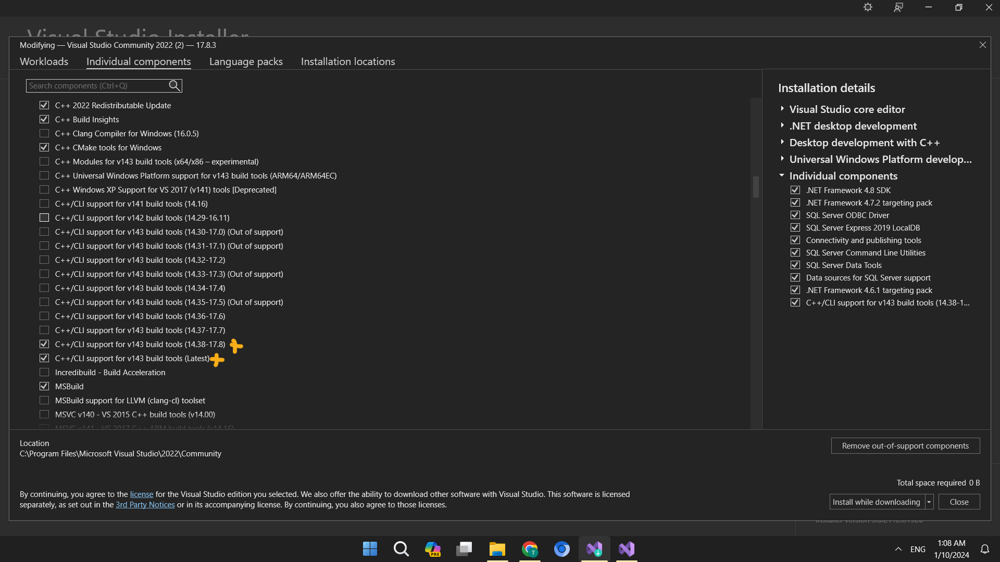

# QUẢN LÝ THƯ VIỆN (C++)
# Tải Visual Studio 2022
LINK : https://visualstudio.microsoft.com/#vs-section

# Cài Đặt Visual Studio 2022

# Tải SQL Server 2022 Express
LINK : https://www.microsoft.com/en-us/sql-server/sql-server-downloads

# Hướng Dẫn Cài Đặt SQL Server 2022 Express

https://github.com/huynhmainhatminh/quan_ly_thu_vien/assets/156114356/f215c0ac-1f43-43e1-9ada-260f8b9c1c96

# Kênh Youtube
LINK : https://www.youtube.com/watch?v=lP7ruakDzz4

# Thông tin

Dự án được code dựa vào Windows Form được sự hỗ trợ của tiện ích toolbox
+ Giao diện đăng nhập, đăng ký
+ Kết nối với cơ sở dữ liệu (SQL Server)
+ Giao diện quản lý sách, người dùng

Tác giả : Huỳnh Mai Nhật Minh & Người đóng góp : Lượng Đình Duy, Lâm Tiến Đạt

